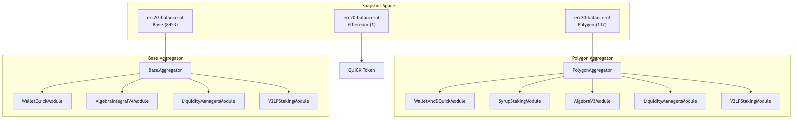

# QuickSwap Voting

Snapshot voting power wrappers for QuickSwap governance.

## Architecture



## Modules

| Module | Chain | Description |
|--------|-------|-------------|
| `WalletAndDQuickModule` | Polygon | Wallet QUICK + Dragon's Lair |
| `WalletQuickModule` | Base, Eth | Wallet QUICK only |
| `SyrupStakingModule` | Polygon | Syrup pools (factory + legacy) |
| `AlgebraV3Module` | Polygon | V3 LP positions + farming |
| `AlgebraIntegralModule` | Base | Algebra Integral (v4) LP positions |
| `GammaVaultsModule` | All | Gamma hypervisor vaults |
| `V2LPStakingModule` | All | V2 LP staking pools |

## Contracts

```sh
contracts/
├── interfaces/
│   └── IVotingModule.sol           # Module interface
├── modules/
│   ├── WalletAndDQuickModule.sol   # Polygon: Wallet + Dragon's Lair
│   ├── WalletQuickModule.sol       # Base/Eth: Wallet only
│   ├── SyrupStakingModule.sol      # Polygon: Syrup pools
│   ├── AlgebraV3Module.sol         # Polygon: Algebra v3
│   ├── AlgebraIntegralModule.sol   # Base: Algebra v4
│   ├── GammaVaultsModule.sol       # All: Gamma hypervisors
│   ├── V2LPStakingModule.sol       # All: V2 LP staking
│   └── Ownable.sol                 # Admin utilities
└── aggregators/
    ├── PolygonAggregator.sol       # Combines Polygon modules
    └── BaseAggregator.sol          # Combines Base modules
```

## Deployment

```bash
# Environment
export PRIVATE_KEY=0x...
export POLYGON_RPC=https://...

# Compile
pnpm exec hardhat compile

# Deploy
pnpm exec hardhat run scripts/deploy-polygon-aggregator.js --network polygon
```

## Snapshot Configuration

```json
{
  "strategies": [
    {
      "name": "erc20-balance-of",
      "network": "137",
      "params": { "address": "<POLYGON_AGGREGATOR>", "symbol": "QUICK", "decimals": 18 }
    },
    {
      "name": "erc20-balance-of",
      "network": "8453",
      "params": { "address": "<BASE_AGGREGATOR>", "symbol": "QUICK", "decimals": 18 }
    }
  ]
}
```

## Monitoring

```bash
pnpm run monitor:limits
```

Exit codes: `0` OK, `1` warning (>90%), `2` critical (≥100%)

## Testing

```bash
pnpm test                    # All tests
pnpm run baseline:capture    # Capture baseline
pnpm run typecheck           # Type check
```

### RPC Configuration

For reliable test execution, configure private RPCs:

```bash
export BASE_RPC="https://base-mainnet.infura.io/v3/<YOUR_KEY>"
export POLYGON_RPC="https://polygon-mainnet.infura.io/v3/<YOUR_KEY>"
export ETHEREUM_RPC="https://mainnet.infura.io/v3/<YOUR_KEY>"
```

Tests will automatically retry with exponential backoff on rate limits.

## Addresses

### Polygon (137)

| Contract | Address |
|----------|---------|
| QUICK | `0xB5C064F955D8e7F38fE0460C556a72987494eE17` |
| Dragon's Lair | `0x958d208Cdf087843e9AD98d23823d32E17d723A1` |
| Position Manager | `0x8eF88E4c7CfbbaC1C163f7eddd4B578792201de6` |
| Farming Center | `0x7F281A8cdF66eF5e9db8434Ec6D97acc1bc01E78` |
| Pool Deployer | `0x2D98E2FA9da15aa6dC9581AB097Ced7af697CB92` |
| Syrup Factory | `0xEDA776E7e1111BE5E82F9148B2deF870f99c1908` |

### Base (8453)

| Contract | Address |
|----------|---------|
| QUICK | `0x7094c27f342DBAdfbbeD005b219431595E33b305` |
| Position Manager | `0x84715977598247125C3D6E2e85370d1F6fDA1eaF` |
| Factory | `0x411b0facc3489691f28ad58c47006af5e3ab3a28` |

### Ethereum (1)

| Contract | Address |
|----------|---------|
| QUICK | `0xd2bA23dE8a19316A638dc1e7a9ADdA1d74233368` |

## Admin

Allowlists updatable without redeployment:

```solidity
gammaModule.setVaults(newVaults);
v2Module.setStakingPools(newPools);
syrupModule.setLegacyPools(newPools);
```

## License

MIT
